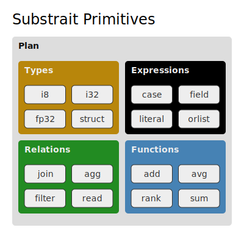
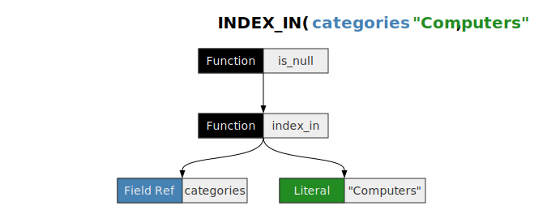
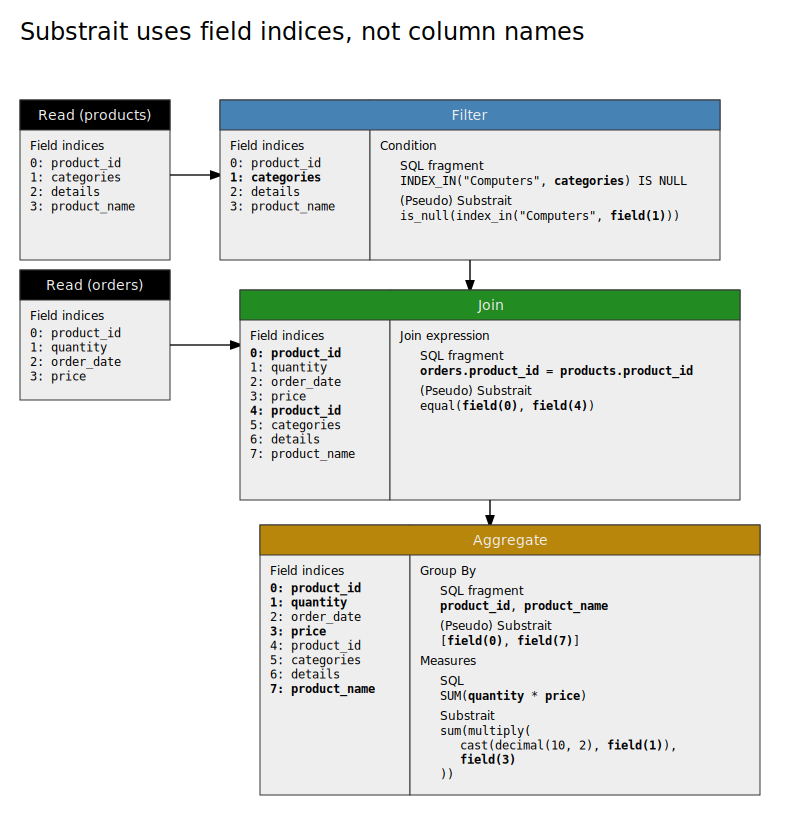

# SQL to Substrait tutorial

This is an introductory tutorial to learn the basics of Substrait for readers
already familiar with SQL. We will look at how to construct a Substrait plan
from an example query.

We'll present the Substrait in JSON form to make it relatively readable to
newcomers. Typically Substrait is exchanged as a protobuf message, but for
debugging purposes it is often helpful to look at a serialized form. Plus,
it's not uncommon for unit tests to represent plans as JSON strings. So
if you are developing with Substrait, it's useful to have experience reading
them.

!!! note
    Substrait is currently only defined with Protobuf. The JSON provided here is the
    Protobuf JSON output, but it is *not* the official Substrait text format. Eventually,
    Substrait will define it's own human-readable text format, but for now this
    tutorial will make due with what Protobuf provides.

Substrait is designed to communicate plans (mostly logical plans). Those plans
contain types, schemas, expressions, extensions, and relations. We'll look at 
them in that order, going from simplest to most complex until we can construct
full plans.



This tutorial won't cover all the details of each piece, but it will give you an
idea of how they connect together. For a detailed reference of each individual 
field, the best place to look is reading the 
[protobuf definitions](https://github.com/substrait-io/substrait/tree/main/proto/substrait).
They represent the source-of-truth of the spec and are well-commented to address
ambiguities.

## Problem Set up

To learn Substrait, we'll build up to a specific query. We'll be using the
tables:

```sql
CREATE TABLE orders (
  product_id: i64 NOT NULL,
  quantity: i32 NOT NULL,
  order_date: date NOT NULL,
  price: decimal(10, 2)
);
```

```sql
CREATE TABLE products (
  product_id: i64 NOT NULL,
  categories: list<string NOT NULL> NOT NULL,
  details: struct<manufacturer: string, year_created: int32>,
  product_name: string
);
```

This `orders` table represents events where products were sold, recording how
many (`quantity`) and at what price (`price`). The `products` table provides
details for each product, with `product_id` as the primary key.

And we'll try to create the query:

```sql
SELECT
  product_name,
  product_id,
  sum(quantity * price) as sales
FROM
  orders
INNER JOIN
  products
ON
  orders.product_id = products.product_id
WHERE
  -- categories does not contain "Computers"
  INDEX_IN("Computers", categories) IS NULL
GROUP BY
  product_name,
  product_id
```

The query asked the question: For products that aren't in the `"Computer"`
category, how much has each product generated in sales?

However, Substrait doesn't correspond to SQL as much as it does to logical plans.
So to be less ambiguous, the plan we are aiming for looks like:

```
|-+ Aggregate({sales = sum(quantity_price)}, group_by=(product_name, product_id))
  |-+ InnerJoin(on=orders.product_id = products.product_id)
    |- ReadTable(orders)
    |-+ Filter(INDEX_IN("Computers", categories) IS NULL)
      |- ReadTable(products)
```

## Types and Schemas

As part of the Substrait plan, we'll need to embed the data types of the input
tables. In Substrait, each type is a distinct message, which at a minimum 
contains a field for nullability. For example, a string field looks like:

```json
{
  "string": {
    "nullability": "NULLABILITY_NULLABLE"
  }
}
```

Nullability is an enum not a boolean, since Substrait allows 
`NULLABILITY_UNSPECIFIED` as an option, in addition to `NULLABILITY_NULLABLE`
(nullable) and `NULLABILITY_REQUIRED` (not nullable).

Other types such as `VarChar` and `Decimal` have other parameters. For example,
our `orders.price` column will be represented as:

```json
{
  "decimal": {
    "precision": 10,
    "scale": 2,
    "nullability": "NULLABILITY_NULLABLE"
  }
}
```

Finally, there are nested compound types such as structs and list types that 
have other types as parameters. For example, the `products.categories` column
is a list of strings, so can be represented as:

```json
{
  "list": {
    "type": {
      "string": {
        "nullability": "NULLABILITY_REQUIRED"
      }
    },
    "nullability": "NULLABILITY_REQUIRED"
  }
}
```

To know what parameters each type can take, refer to the Protobuf definitions in
[type.proto](https://github.com/substrait-io/substrait/blob/main/proto/substrait/type.proto).

Schemas of tables can be represented with a `NamedStruct` message, which is the
combination of a struct type containing all the columns and a list of column
names. For the `orders` table, this will look like:

```json
{
  "names": [
    "product_id",
    "quantity",
    "order_date",
    "price"
  ],
  "struct": {
    "types": [
      {
        "i64": {
          "nullability": "NULLABILITY_REQUIRED"
        }
      },
      {
        "i32": {
          "nullability": "NULLABILITY_REQUIRED"
        }
      },
      {
        "date": {
          "nullability": "NULLABILITY_REQUIRED"
        }
      },
      {
        "decimal": {
          "precision": 10,
          "scale": 2,
          "nullability": "NULLABILITY_NULLABLE"
        }
      }
    ],
    "nullability": "NULLABILITY_REQUIRED"
  }
}
```

Here, `names` is the names of all fields. In nested schemas, this includes the
names of subfields in depth-first order. So for the `products` table, the 
`details` struct field will be included as well as the two subfields (`manufacturer`
and `year_created`) right after. And because it's depth first, these subfields
appear before `product_name`. The full schema looks like:

```json
{
  "names": [
    "product_id",
    "categories",
    "details",
    "manufacturer",
    "year_created",
    "product_name"
  ],
  "struct": {
    "types": [
      {
        "i64": {
          "nullability": "NULLABILITY_REQUIRED"
        }
      },
      {
        "list": {
          "type": {
            "string": {
              "nullability": "NULLABILITY_REQUIRED"
            }
          },
          "nullability": "NULLABILITY_REQUIRED"
        }
      },
      {
        "struct": {
          "types": [
            {
              "string": {
                "nullability": "NULLABILITY_NULLABLE"
              },
              "i32": {
                "nullability": "NULLABILITY_NULLABLE"
              }
            }
          ],
          "nullability": "NULLABILITY_NULLABLE"
        }
      },
      {
        "string": {
          "nullability": "NULLABILITY_NULLABLE"
        }
      }
    ],
    "nullability": "NULLABILITY_REQUIRED"
  }
}
```

## Expressions

The next basic building block we will need is expressions. Expressions can be
one of several things, including:

 * Field references
 * Literal values
 * Functions
 * Subqueries
 * Window Functions

Since some expressions such as functions can contain other expressions,
expressions can be represented as a tree. Literal values and field references
typically are the leaf nodes.

For the expression `INDEX_IN(categories, "Computers") IS NULL`, we have a 
field reference `categories`, a literal string `"Computers"`, and two functions---
`INDEX_IN` and `IS NULL`.



The field reference for `categories` is represented by:

```json
{
  "selection": {
    "directReference": {
      "structField": {
        "field": 1
      }
    },
    "rootReference": {}
  }
}
```

Whereas SQL references field by names, Substrait always references fields 
numerically. This means that a Substrait expression only makes sense relative
to a certain schema. As we'll see later when we discuss relations, for a filter
relation this will be relative to the input schema, so the `1` here is referring 
to the second field of `products`.

!!! note
    Protobuf may not serialize fields with integer type and value 0, since 0 is the default.
    So if you instead saw `"structField": {}`, know that is is equivalent to 
    `"structField": { "field": 0 }`.

`"Computers"` will be translated to a literal expression:

```json
{
  "literal": {
    "string": "Computers"
  }
}
```

Both `IS NULL` and `INDEX_IN` will be scalar function expressions. Available 
functions in Substrait are defined in extension YAML files contained in 
https://github.com/substrait-io/substrait/tree/main/extensions. Additional
extensions may be created elsewhere. `IS NULL` is defined as a `is_null` function
in 
[functions_comparison.yaml](https://github.com/substrait-io/substrait/blob/main/extensions/functions_comparison.yaml#:~:text=%2D-,name%3A%20%22is_null%22,-description%3A%20Whether)
and `INDEX_IN` is defined as `index_in` function in
[functions_set.yaml](https://github.com/substrait-io/substrait/blob/main/extensions/functions_set.yaml#:~:text=%2D-,name%3A%20%22index_in%22,-description%3A%20%3E).

First, the expression for `INDEX_IN("Computers", categories)` is:

```json
{
  "scalarFunction": {
    "functionReference": 1,
    "outputType": {
      "i64": {
        "nullability": "NULLABILITY_NULLABLE"
      }
    },
    "arguments": [
      {
        "value": {
          "literal": {
            "string": "Computers"
          }
        }
      },
      {
        "value": {
          "selection": {
            "directReference": {
              "structField": {
                "field": 1
              }
            },
            "rootReference": {}
          }
        }
      }
    ]
  }
}
```

`functionReference` will be explained later in the plans section. For now,
understand that it's a ID that corresponds to an entry in a list of function
definitions that we will create later.

`outputType` defines the type the function outputs. We know this is a nullable
`i64` type since that is what the function definition declares in the YAML file.

`arguments` defines the arguments being passed into the function, which are all
done positionally based on the function definition in the YAML file. The two 
arguments will be familiar as the literal and the field reference we
constructed earlier.

To create the final expression, we just need to wrap this in another scalar
function expression for `IS NULL`.

```json
{
  "scalarFunction": {
    "functionReference": 2,
    "outputType": {
      "bool": {
        "nullability": "NULLABILITY_REQUIRED"
      }
    },
    "arguments": [
      {
        "value": {
          "scalarFunction": {
            "functionReference": 1,
            "outputType": {
              "i64": {
                "nullability": "NULLABILITY_NULLABLE"
              }
            },
            "arguments": [
              {
                "value": {
                  "literal": {
                    "string": "Computers"
                  }
                }
              },
              {
                "value": {
                  "selection": {
                    "directReference": {
                      "structField": {
                        "field": 1
                      }
                    },
                    "rootReference": {}
                  }
                }
              }
            ]
          }
        }
      }
    ]
  }
}
```

To see what other types of expressions are available and what fields they take,
see the `Expression` proto definition in 
[algebra.proto](https://github.com/substrait-io/substrait/blob/main/proto/substrait/algebra.proto#:~:text=message-,Expression,-%7B).

## Relations

In most SQL engines, a logical or physical plan is represented as a tree of 
nodes, such as filter, project, scan, or join. The left diagram below may be a 
familiar representation of our plan, where nodes feed data into each other
moving from left to right. In Substrait, each of these nodes is a **Relation**.


A relation that takes another relation as input will contain (or refer to) that
relation. This is usually a field called `input`, but sometimes different names
are used in relations that take multiple inputs. For example, join relations
take two inputs, with field names `left` and `right`. In JSON, the rough 
layout for the relations in our plan will look like:

```json
{
    "aggregate": {
        "input": {
            "join": {
                "left": {
                    "filter": {
                        "input": {
                            "read": {
                                ...
                            }
                        },
                        ...
                    }
                },
                "right": {
                    "read": {
                        ...
                    }
                },
                ...
            }
        },
        ...
    }
}
```

For our plan, we need to define the read relations for each table, a filter 
relation to exclude the `"Computer"` category from the `products` table, a
join relation to perform the inner join, and finally an aggregate relation
to compute the total sales.

The read relations are composed of a `baseSchema` and a `namedTable` field.
The type of read is a named table, so the `namedTable` field is present with 
`names` containing the list of name segments (`my_database.my_table`). Other types
of reads include virtual tables (a table of literal values embedded in the plan)
and a list of files. See [Read Definition Types](/relations/logical_relations/#read-definition-types) for more details.
The `baseSchema` is the schemas we defined earlier and `namedTable` are just
the names of the tables. So for reading the `orders` table, the relation looks
like:

```json
{
  "read": {
    "namedTable": {
      "names": [
        "orders"
      ]
    },
    "baseSchema": {
      "names": [
        "product_id",
        "quantity",
        "order_date",
        "price"
      ],
      "struct": {
        "types": [
          {
            "i64": {
              "nullability": "NULLABILITY_REQUIRED"
            }
          },
          {
            "i32": {
              "nullability": "NULLABILITY_REQUIRED"
            }
          },
          {
            "date": {
              "nullability": "NULLABILITY_REQUIRED"
            }
          },
          {
            "decimal": {
              "scale": 10,
              "precision": 2,
              "nullability": "NULLABILITY_NULLABLE"
            }
          }
        ],
        "nullability": "NULLABILITY_REQUIRED"
      }
    }
  }
}
```

Read relations are leaf nodes. Leaf nodes don't depend on any other node for data
and usually represent a source of data in our plan. Leaf nodes are then typically
used as input for other nodes that manipulate the data. For example, our filter
node will take the `products` read relation as an input.

The filter node will also take a `condition` field, which will just be the
expression we constructed earlier.

```json
{
  "filter": {
    "input": {
      "read": { ... }
    },
    "condition": {
      "scalarFunction": {
        "functionReference": 2,
        "outputType": {
          "bool": {
            "nullability": "NULLABILITY_REQUIRED"
          }
        },
        "arguments": [
          {
            "value": {
              "scalarFunction": {
                "functionReference": 1,
                "outputType": {
                  "i64": {
                    "nullability": "NULLABILITY_NULLABLE"
                  }
                },
                "arguments": [
                  {
                    "value": {
                      "literal": {
                        "string": "Computers"
                      }
                    }
                  },
                  {
                    "value": {
                      "selection": {
                        "directReference": {
                          "structField": {
                            "field": 1
                          }
                        },
                        "rootReference": {}
                      }
                    }
                  }
                ]
              }
            }
          }
        ]
      }
    }
  }
}
```

The join relation will take two inputs. In the `left` field will be the read
relation for `orders` and in the `right` field will be the filter relation
(from `products`). The `type` field is an enum that allows us to specify
we want an inner join. Finally, the `expression` field contains the expression
to use in the join. Since we haven't used the `equals()` function yet, we use
the reference number 2 here. (Again, we'll see at the end with [plans](#plans)
how these functions are resolved.) The arguments refer to fields 0 and 4, which
are indices into the combined schema formed from the left and right inputs.
We'll discuss later in [Field Indices](#field-indices) where these come from.

```json
{
  "join": {
    "left": { ... },
    "right": { ... },
    "type": "JOIN_TYPE_INNER",
    "expression": {
      "scalarFunction": {
        "functionReference": 3,
        "outputType": {
          "bool": {
            "nullability": "NULLABILITY_NULLABLE"
          }
        },
        "arguments": [
          {
            "value": {
              "selection": {
                "directReference": {
                  "structField": {
                    "field": 0
                  }
                },
                "rootReference": {}
              }
            }
          },
          {
            "value": {
              "selection": {
                "directReference": {
                  "structField": {
                    "field": 4
                  }
                },
                "rootReference": {}
              }
            }
          }
        ]
      }
    }
  }
}
```

The final aggregation requires two things, other than the input. First is the
groupings. We'll use a single grouping expression containing the references to
the fields `product_name` and `product_id`. (Multiple grouping expressions can
be used to do cube aggregations.)

For `measures`, we'll need to define `sum(quantity * price) as sales`. Substrait
is stricter about data types, and quantity is an integer while price is a
decimal. So we'll first need to cast `quantity` to a decimal, making the
Substrait expression more like `sum(multiply(cast(decimal(10, 2), quantity), price))`.
Both `sum()` and `multiply()` are functions, defined in 
[functions_arithmetic_demical.yaml](https://github.com/substrait-io/substrait/blob/main/extensions/functions_arithmetic_decimal.yaml).
However `cast()` is a special expression type in Substrait, rather than a
function.

Finally, the naming with `as sales` will be handled at the end as part of the
plan, so that's not part of the relation. Since we are always using field 
indices to refer to fields, Substrait doesn't record any intermediate field
names.

```json
{
  "aggregate": {
    "input": { ... },
    "groupings": [
      {
        "groupingExpressions": [
          {
            "value": {
              "selection": {
                "directReference": {
                  "structField": {
                    "field": 0
                  }
                },
                "rootReference": {}
              }
            }
          },
          {
            "value": {
              "selection": {
                "directReference": {
                  "structField": {
                    "field": 7
                  }
                },
                "rootReference": {}
              }
            }
          },
        ]
      }
    ],
    "measures": [
      {
        "measure": {
          "functionReference": 3,
          "outputType": {
            "decimal": {
              "precision": 38,
              "scale": 2,
              "nullability": "NULLABILITY_NULLABLE"
            }
          },
          "arguments": [
            {
              "value": {
                "scalarFunction": {
                  "functionReference": 4,
                  "outputType": {
                    "decimal": {
                      "precision": 38,
                      "scale": 2,
                      "nullability": "NULLABILITY_NULLABLE"
                    }
                  },
                  "arguments": [
                    {
                      "value": {
                        "cast": {
                          "type": {
                            "decimal": {
                              "precision": 10,
                              "scale": 2,
                              "nullability": "NULLABILITY_REQUIRED"
                            }
                          },
                          "input": {
                            "selection": {
                              "directReference": {
                                "structField": {
                                  "field": 1
                                }
                              },
                              "rootReference": {}
                            }
                          }
                        }
                      }
                    },
                    {
                      "value": {
                        "selection": {
                          "directReference": {
                            "structField": {
                              "field": 3
                            }
                          },
                          "rootReference": {}
                        }
                      }
                    }
                  ]
                }
              }
            }
          ]
        }
      }
    ]
  }
}
```

## Field indices

So far, we have glossed over the field indices. Now that we've built up each
of the relations, it will be a bit easier to explain them.

Throughout the plan, data always has some implicit schema, which is modified
by each relation. Often, the schema can change *within* a relation--we'll discuss
an example in the next section. Each relation has it's own rules in how schemas
are modified, called the output order or emit order. For the purposes of our 
query, the relevant rules are:

* For Read relations, their output schema is the schema of the table.
* For Filter relations, the output schema is the same as in the input schema.
* For Joins relations, the input schema is the concatenation of the left and then the
  right schemas. The output schema is the same.
* For Aggregate relations, the output schema is the group by fields followed by
  the measures.


!!! note
    Sometimes it can be hard to tell what the implicit schema is. For help
    determining that, consider using the substrait-validator tool, described
    in [Next Steps](#next-steps).

The diagram below shows the mapping of field indices within each relation and
how each of the field references show up in each relations properties.



## Column selection and emit

As written, the aggregate output schema will be:

```
0: product_id: i64
1: product_name: string
2: sales: decimal(32, 8)
```

But we want `product_name` to come before `product_id` in our output. How do we
reorder those columns?

<!-- TODO: Make this example less artificial -->

You might be tempted to add a [Project relation](/relations/logical_relations/#project-operation) 
at the end. However, the project relation only adds columns; it is not
responsible for subsetting or reordering columns.

Instead, any relation can reorder or subset columns through the `emit` property.
By default, it is set to `direct`, which outputs all columns "as is". But it can
also be specified as a sequence of field indices.

For simplicity, we will add this to the final aggregate relation. We could also
add it to all relations, only selecting the fields we strictly need in later
relations. Indeed, a good optimizer would probably do that to our plan. And for
some engines, the emit property is only valid within a project relation, so in
those cases we would need to add that relation in combination with emit. But to
keep things simple, we'll limit the columns at the end within the aggregation
relation.

For our final column selection, we'll modify the top-level relation to be:

```json
{
  "aggregate": {
    "input": { ... },
    "groupings": [ ... ],
    "measures": [ ... ],
    "common": {
      "emit": {
        "outputMapping": [1, 0, 2]
      }
    }
}
```

## Plans

Now that we've constructed our relations, we can put it all into a plan.
Substrait plans are the only messages that can be sent and received on their
own. Recall that earlier, we had function references to those YAML files, but
so far there's been no place to tell a consumer what those function reference
IDs mean or which extensions we are using. That information belongs at the plan
level.

The overall layout for a plan is

```json
{
  "extensionUris": [ ... ],
  "extensions": [ ... ],
  "relations": [
    {
      "root": {
        "names": [
          "product_name",
          "product_id",
          "sales"
        ],
        "input": { ... }
      }
    }
  ]
}
```

The `relations` field is a list of Root relations. Most queries only have one 
root relation, but the spec allows for multiple so a common plan could be
referenced by other plans, sort of like a CTE (Common Table Expression) from SQL.
The root relation provides the final column names for our query. The input to
this relation is our aggregate relation (which contains all the other relations
as children).

For extensions, we need to provide `extensionUris` with the locations of the 
YAML files we used and `extensions` with the list of functions we used and which
extension they come from.

In our query, we used:

 * `index_in` (1), from `functions_string.yaml`,
 * `is_null` (2), from `functions_comparison.yaml`,
 * `equal` (3), from `functions_comparison.yaml`,
 * `sum` (4), from `functions_arithmetic_decimal.yaml`,
 * `multiply` (5), from `functions_arithmetic_decimal.yaml`.

So first we can create the three extension uris:

```json
[
  {
    "extensionUriAnchor": 1,
    "uri": "https://github.com/substrait-io/substrait/blob/main/extensions/functions_string.yaml"
  },
  {
    "extensionUriAnchor": 2,
    "uri": "https://github.com/substrait-io/substrait/blob/main/extensions/functions_comparison.yaml"
  },
  {
    "extensionUriAnchor": 3,
    "uri": "https://github.com/substrait-io/substrait/blob/main/extensions/functions_arithmetic_decimal.yaml"
  }
]
```

Then we can create the extensions:

```json
[
  {
    "extensionFunction": {
      "extensionUriReference": 1,
      "functionAnchor": 1,
      "name": "index_in"
    }
  },
  {
    "extensionFunction": {
      "extensionUriReference": 2,
      "functionAnchor": 2,
      "name": "is_null"
    }
  },
  {
    "extensionFunction": {
      "extensionUriReference": 2,
      "functionAnchor": 3,
      "name": "equal"
    }
  },
  {
    "extensionFunction": {
      "extensionUriReference": 3,
      "functionAnchor": 4,
      "name": "sum"
    }
  },
  {
    "extensionFunction": {
      "extensionUriReference": 3,
      "functionAnchor": 5,
      "name": "multiply"
    }
  }
]
```

Once we've added our extensions, the plan is complete. Our plan outputted in
full is: [final_plan.json](./final_plan.json).


## Next steps

**Validate and introspect plans using 
[substrait-validator](https://github.com/substrait-io/substrait-validator)**.
Amongst other things, this tool can show what the current schema and column
indices are at each point in the plan. Try downloading the final plan JSON above
and generating an HTML report on the plan with:

```sh
substrait-validator final_plan.json --out-file output.html
```

<!-- TODO: Link to helpful tools as next steps.
     https://github.com/substrait-io/substrait/issues/392 -->